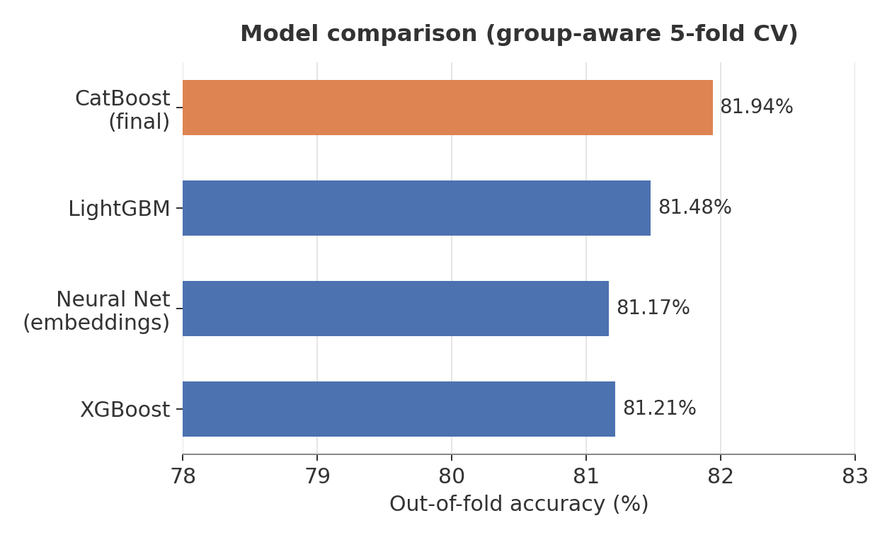
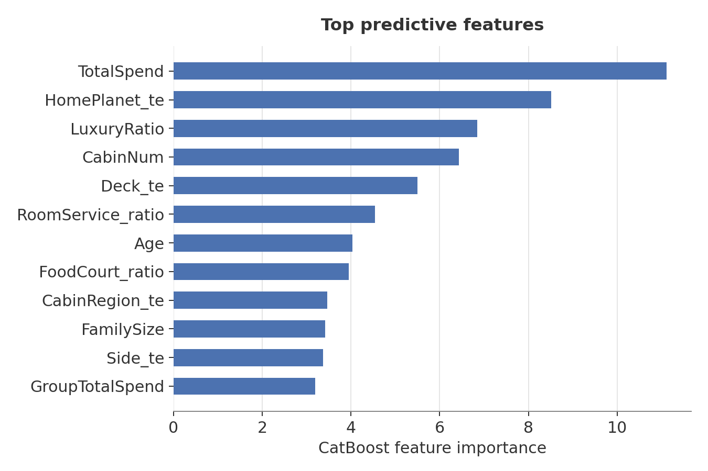
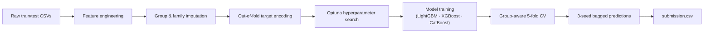
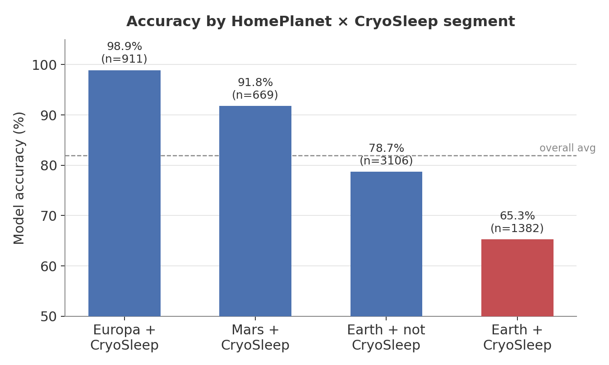

# Spaceship Titanic

[](https://www.python.org/)
[](LICENSE)
[](https://www.kaggle.com/competitions/spaceship-titanic)

A solution to Kaggle's [Spaceship Titanic](https://www.kaggle.com/competitions/spaceship-titanic) competition — a binary classification task predicting which passengers were transported to an alternate dimension during an anomaly encounter.

| | |
|---|---|
| **Public leaderboard score** | 0.80383 |
| **Out-of-fold CV accuracy** | 81.94% |
| **Final model** | CatBoost, 3-seed bagged |
| **Validation strategy** | Group-aware 5-fold CV |

## Results



CatBoost was tuned with Optuna and evaluated against LightGBM, XGBoost, and a PyTorch neural network under identical cross-validation, and came out ahead on every fold.



Total spend, HomePlanet, and cabin location dominate the model's decisions — consistent with the underlying premise of the dataset, where cabin location and CryoSleep status determine passengers' exposure to the anomaly.

## Pipeline



**Feature engineering** — group and family structure extracted from `PassengerId` and `Name`; cabin deck, side, and region parsed from `Cabin`; per-category spend ratios and a luxury-spend ratio; group-level spend and CryoSleep aggregates; group/family-based imputation for missing `HomePlanet` and `Destination`; CryoSleep imputed from spend patterns, since cryosleeping passengers spend nothing.

**Models** — LightGBM, XGBoost, and CatBoost, each hyperparameter-tuned with Optuna (`tune.py`) and evaluated with `StratifiedGroupKFold`, so passengers from the same travel group never leak across train/validation folds.

**Target encoding** — smoothed out-of-fold mean-target encoding for the primary categorical features, fit per fold to avoid leakage. This was the single feature-engineering change with the clearest, most reproducible lift.

**Final model** — CatBoost, with predictions bagged across three CV-split seeds to reduce variance.

## Approaches that were tested and discarded

| Idea | Result | Why |
|---|---|---|
| Cross-group family aggregates (spend/CryoSleep linked by surname) | ↓ accuracy | 2,406 unique surnames across ~12,700 passengers — surname collisions between unrelated families added noise, not signal |
| Hand-built interaction features (CryoSleep/spend flag, cabin rank, HomePlanet × Deck) | ↓ accuracy | Overfit to training-set quirks rather than generalizable structure |
| Neural network (PyTorch, entity embeddings) | 81.2% vs. 81.9% for CatBoost | Predictions correlated 0.97 with CatBoost's — too little diversity to help an ensemble, and gradient-boosted trees typically dominate on datasets this size (~8,700 rows) |
| Ensembling / stacking the three GBMs | No improvement over CatBoost alone | Confirmed with nested cross-validation rather than an in-sample fit |

## Misclassification analysis



Segmenting errors by `HomePlanet × CryoSleep` reveals a clear, non-random pattern in where the model struggles. For Europa and Mars, CryoSleep is a near-deterministic predictor of the outcome, and the model exploits it almost perfectly. For Earth passengers in CryoSleep — 16% of the dataset — the outcome is close to even odds, and the model can barely beat the base rate. Comparing predicted probabilities against actual rates within that segment shows the model has already extracted what weak signal exists there (e.g. cabin side, destination). This segment appears to be the effective accuracy ceiling for the dataset as a whole.

## Repository structure

```
.
├── train_model.py     # feature engineering + final training pipeline
├── tune.py             # Optuna hyperparameter search → best_params.json
├── experiment.py       # ablation tests for candidate improvements
├── nn_model.py          # PyTorch neural network baseline (entity embeddings)
├── make_charts.py       # regenerates the charts in assets/
├── best_params.json    # tuned hyperparameters
├── submission.csv      # final Kaggle submission
└── assets/              # README charts
```

## Reproducing this

Competition data (`data/`) is not included, per Kaggle's data redistribution terms. Download it from the [competition page](https://www.kaggle.com/competitions/spaceship-titanic/data) and place `train.csv`, `test.csv`, and `sample_submission.csv` in a local `data/` folder, then:

```bash
python3 tune.py           # optional — writes best_params.json
python3 train_model.py    # trains and writes submission.csv
```

## License

[MIT](LICENSE)
